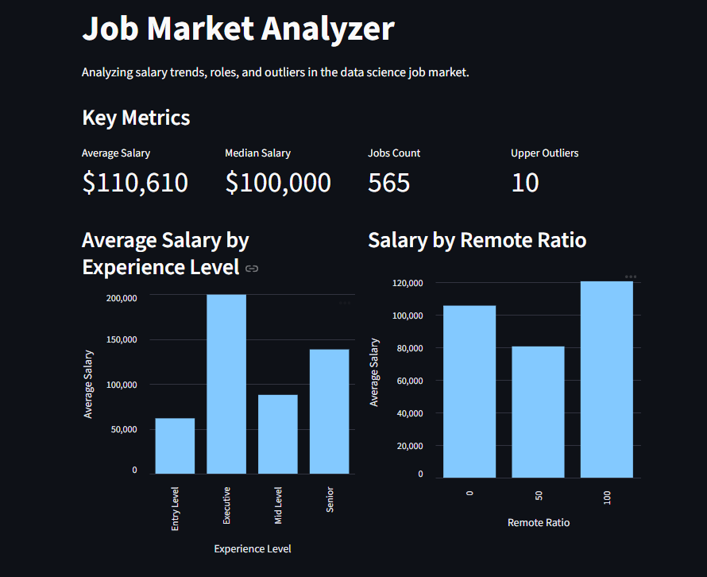
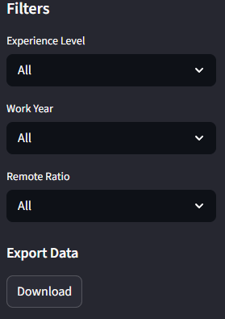
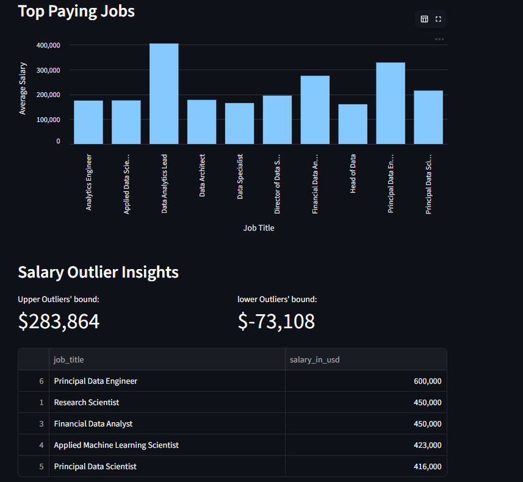

# Job Market Analyzer

### Overview:

A data analysis application and interactive dashboard for exploring data science job market trends,
including salary distributions, experience-level salary comparisons, and outlier detection.
### Features:

- Data cleaning and preprocessing pipeline
- validation layer (Generic and job-market-specific rules)
- - Salary analysis (mean, median, top-paying roles, outlier counts)
- Outlier detection (using IQR method)
- Interactive dashboard
- - Interactive filtering by experience level, year, and remote ratio
- Exporting filtered data as a CSV

### Tech Stack:

- Python
- Pandas
- Streamlit
- Matplotlib

### Project Structure:

```
app/
│
├── ingestion/      Data loading
├── processing/     Cleaning logic
├── validation/     Validation rules
├── analysis/       Salary and outlier analysis
└── utils/          Helpers and path handling

dashboard/
└── streamlit_app.py

data/
└── raw/
```

### Running Instructions:

1) Install dependencies:
    
        pip install -r requirements.txt
2) Run Streamlit app:

        streamlit run dashboard/streamlit_app.py

### Screenshots:

#### Dashboard homepage:


#### Filters:


#### Top paying jobs and Outliers analysis:


### Future plans:
- Integrate live or continuously updated datasets
- Adding Database integration
- Move to Plotly for visualization

### Dataset:
The project uses a dataset from kaggle, provided by Ruchi Bhatia.

 link:  https://www.kaggle.com/datasets/ruchi798/data-science-job-salaries
      